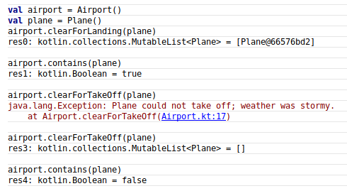
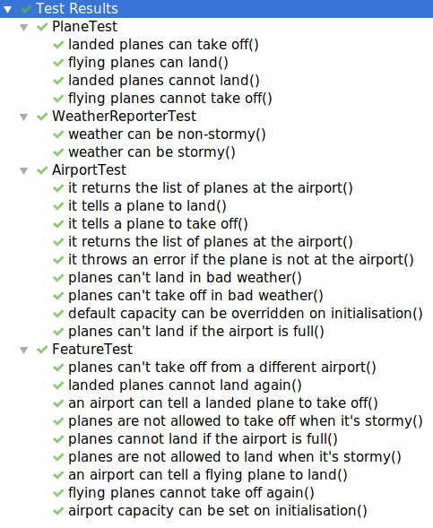

# Airport Challenge in Kotlin

Makers Academy Airport Challenge, this time in Kotlin. Instructions are
[here](instructions.md).

## Instructions

- Download it
- Compile it
- Load it in your Kotlin REPL
- Land and fly planes like this:

## Testing

- Run the tests using your favourite test runner

## Technology

- Kotlin
- JUnit 5 (I started with JUnit 4 and then changed)
- MockK

## Thoughts etc.

In [this
commit](https://github.com/Hives/airport-challenge-kotlin/commit/25688a82c5d8275059c1f273998f2dff4213ba86)
I refactored the tests so that the planes and airports were initialised outside
the test functions. I would have thought this would break the tests, as a plane
landed at the airport in the first test would still be at the airport in the
second test, but... it didn't. Why is that?
- It's because JUnit 4 reinitialises the test class for each test - which might
  be considered a waster of time and resources. You can get around this in Java,
  but the equivalent solution in Kotlin is quite nasty. Solution is to use JUnit
  5, which is more friendly with Kotlin. See this vid:
  <https://www.youtube.com/watch?v=RX_g65J14H0&t=210>
- Well I switched to JUnit 5, but I still went with the default behaviour of
  reinitialising the test class for every test. I tried only initialising the
  test class once, and resetting objects and mocks as necessary between tests,
  but the tests took several times longer to run (nearly 2s as opposed to 270ms)
  so I figured it wasn't worth it. (Maybe I was doing something wrong...)

I tried using JUnit 5's `@Nested` annotation to group my tests, but for some
reason it didn't nest the tests in the Gradle test output window. Would be great
to get that working.
- Got it working - think maybe I was grouping my nested tests inside a `class`
  rather than an `inner class`.
